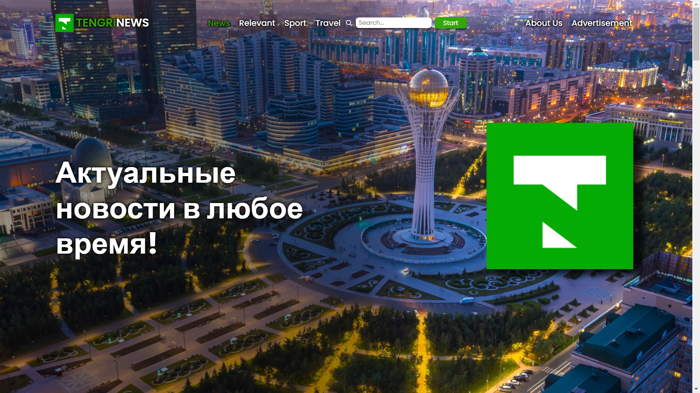

# TengriNews 

[https://api-k3a9.onrender.com/](https://api-k3a9.onrender.com/)

## Описание проекта:
TengriNews - это платформа, предназначенная для просмотра последних новостей из различных источников. Сервис позволяет пользователям быть в курсе последних событий, предоставляя им доступ к новостям по различным категориям, таким как политика, экономика, наука, спорт и другие.

## Особенности моего web-сервиса:
1. **Источники:** Веб-сервис получает запарсенные данные от самого TengriNews-а напрямую, и не упускает каждую новую вышедшую статью. 
   
2. **Категоризация:** Новости сгруппированы по категориям, что упрощает навигацию и помогает пользователям быстро находить интересующие их материалы.

3. **Поиск:** Поиск по ключевым словам или фразам позволяет пользователям найти новости по конкретным запросам.

4. **Деплой:** Сервис находится в хостинге, и вы можете получить user experience: [https://api-k3a9.onrender.com/](https://api-k3a9.onrender.com/)

## Технологии:
- **Frontend:** HTML, CSS, JavaScript
  
- **Backend:** FastAPI(Python), bs4(Python)

## Установка и запуск (Опционально):
1. Клонируйте репозиторий: `git clone https://github.com/mkhmtolzhas/api.git`
   
2. Перейдите в директорию проекта: `cd api`
   
3. Установите зависимости backend:
   ```
   pip install fastapi
   pip install bs4
   pip install uvicorn
   ```
   
4. Запустите backend сервер:
   ```
   uvicorn main:app --reload
   ```
   
5. Откройте браузер и перейдите по адресу `http://localhost:8000` для доступа к новостному веб-сервису.

## На что был сделан упор:
Я проводил свои исследования в виде опроса своих знакомых, близких людей, и по их предпочтениям и рекомендациям я делал, менял свой сайт. Если быть конкретнее:

1. **Дизайн:**  Хотелось внести что то новое и более современное в дизайн основного TengriNews, что бы было приятно для пользователя, а так же удовлетворяло его. А так же мы все знаем что **бренд** - это построить доверие для клиента, в чем как раз таки дизайн играет большую роль, ставя эту компанию на уровень выше чем его конкуренты.

2. **Отображение новостей**: Они отображаются по 4 статьи в одном слайдере, так же как в оригинальном портале TengriNews. Но если спросите почему я это сюда написал, так это мои проведенные исследования. Изначально я хотел для каждой тематики новостей показывать по 1 статье в одном слайдере, но люди которые тогда пользовались моим сайтом сказали что для новостного сайта выгоднее когда много статьи показываются сразу, что бы быстро найти то, что их интересует

## Отдельное спасибо:
Отдельное спасибо nFactorial что дали поучаствовать, а так же получить большой прогресс в этом деле. 

## Почему именно я должен выиграть грант?
 Потому что я всегда открыт к новым прогрессам и знаниям!

## Связь:
В случае возникновения вопросов или предложений, пожалуйста, свяжитесь с нами:
- Электронная почта: mkhmtcore@gmail.com
- Веб-сайт: [https://api-k3a9.onrender.com/](https://api-k3a9.onrender.com/)
- GitHub: [mkhmtolzhas](https://github.com/mkhmtolzhas)

---